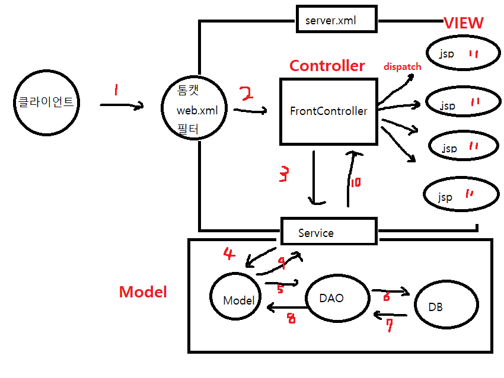

# JSP-Blog-Test

##MySQL 사용자계정 생성 / 테이블 생성
```
create user 'blogtest'@'%' identified by 'bitc5600';
GRANT ALL PRIVILEGES ON *.* TO 'blogtest'@'%';
create database blogtest;
```

```
create table User(
	id int primary key auto_increment,
    username varchar(100) not null unique,
    password varchar(100) not null,
    email varchar(100) not null,
    userRole varchar(20)
);
```
## 환경설정
- JDK 1.8 , MySQL , Tomcat 9.0

## 기능
- 회원가입(insert) , 로그인(select), 유저삭제(delete)

## 사용한 자바기술
- utf-8 필터 , .jsp 자원 직접 접근 금지 필터
- MVC패턴

- JQuery , JSTL , ajax
